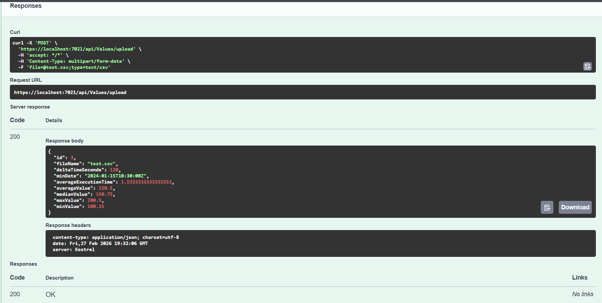

# TimescaleApi

WebAPI-приложение для работы с timescale-данными результатов обработки.

## Стек технологий

- .NET 8
- ASP.NET Core Web API
- Entity Framework Core 8
- PostgreSQL
- Swagger
- xUnit (тесты)

## Структура проекта

Основной проект **TimescaleApi** содержит:

- **Controllers/ValuesController.cs** — API-контроллер с тремя методами (загрузка CSV, получение результатов с фильтрами, последние значения по файлу).
- **Data/AppDbContext.cs** — контекст Entity Framework Core с таблицами Values и Results.
- **DTOs/CsvRecord.cs** — DTO для одной строки CSV-файла.
- **DTOs/ResultFilterDto.cs** — DTO с параметрами фильтрации для запроса результатов.
- **Models/Values.cs** — модель таблицы Values (дата, время выполнения, значение).
- **Models/Result.cs** — модель таблицы Results (агрегированные показатели по файлу).
- **Models/CsvValidationResult.cs** — результат валидации CSV (список ошибок и распарсенные записи).
- **Services/ICsvProcessingService.cs** — интерфейс сервиса обработки CSV.
- **Services/CsvProcessingService.cs** — реализация: парсинг, расчёт агрегатов, сохранение в БД в транзакции.
- **Validators/CsvValidator.cs** — валидация CSV-файла по всем правилам.
- **Migrations/** — миграции EF Core для PostgreSQL.

Тестовый проект **TimescaleApi.Tests** содержит:

- **CsvValidatorTests.cs** — 18 тестов валидатора (форматы, граничные случаи, ошибки).
- **CsvProcessingServiceTests.cs** — 8 тестов сервиса обработки (сохранение, перезапись, агрегаты).

## API-методы

### 1. Загрузка CSV-файла

```
POST /api/values/upload
Content-Type: multipart/form-data
```

Принимает CSV-файл, парсит, валидирует и сохраняет данные в таблицу **Values**.
Из значений рассчитываются агрегаты и записываются в таблицу **Results**.

**Формат CSV:**
```
Date;ExecutionTime;Value
2024-01-15T10-30-00.0000Z;1,50;100,25
2024-01-15T10-31-00.0000Z;2,30;200,50
```

Поддерживаются оба десятичных разделителя: `,` и `.`

**Валидация:**
- Дата — не раньше 01.01.2000 и не позже текущей
- ExecutionTime — не меньше 0
- Value — не меньше 0
- Количество строк — от 1 до 10 000
- Все значения обязательны и должны соответствовать типам

При повторной загрузке файла с тем же именем данные перезаписываются.

**Агрегаты в таблице Results:**

- **DeltaTimeSeconds** — разница между максимальной и минимальной датой в секундах.
- **MinDate** — минимальная дата (момент запуска первой операции).
- **AverageExecutionTime** — среднее время выполнения.
- **AverageValue** — среднее значение показателя.
- **MedianValue** — медиана показателей.
- **MaxValue** — максимальное значение показателя.
- **MinValue** — минимальное значение показателя.

### 2. Получение результатов с фильтрами

```
GET /api/values/results
```

**Параметры фильтрации (все необязательные):**

- **FileName** (string) — имя файла.
- **MinDateFrom** (DateTime) — начало диапазона по дате запуска.
- **MinDateTo** (DateTime) — конец диапазона по дате запуска.
- **AvgValueFrom** (double) — минимальное среднее значение.
- **AvgValueTo** (double) — максимальное среднее значение.
- **AvgExecutionTimeFrom** (double) — минимальное среднее время выполнения.
- **AvgExecutionTimeTo** (double) — максимальное среднее время выполнения.

### 3. Последние значения по файлу

```
GET /api/values/values/{fileName}
```

Возвращает последние 10 записей из таблицы Values, отсортированных по дате (DESC).

## Запуск

### Требования

- [.NET 8 SDK](https://dotnet.microsoft.com/download/dotnet/8.0)
- [PostgreSQL](https://www.postgresql.org/download/)

### Настройка БД

Укажите строку подключения в `appsettings.json`:

```json
{
  "ConnectionStrings": {
    "DefaultConnection": "Host=localhost;Port=5432;Database=infotecs;Username=postgres;Password=your_password"
  }
}
```

### Применение миграций и запуск

```bash
dotnet ef database update --project TimescaleApi
dotnet run --project TimescaleApi
```

Swagger UI будет доступен по адресу: `https://localhost:<port>/swagger`

## Тесты

```bash
dotnet test
```

26 тестов покрывают:
- Все правила валидации CSV (пустой файл, даты, отрицательные значения, лимит строк, форматы и т.д.)
- Обработку десятичных разделителей `,` и `.`
- Сохранение и перезапись данных в БД
- Расчёт агрегатов (среднее, медиана, дельта, мин/макс)

## Скриншоты

### Swagger




### База данных — таблица Values


### База данных — таблица Results


